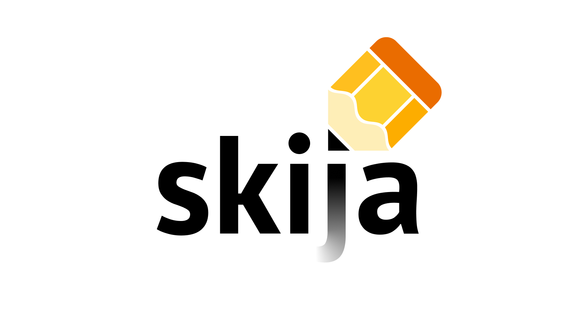

# Skija: Skia bindings for Java

Skia is an open source 2D graphics library which provides common APIs that work across a variety of hardware and software platforms. Skija is a high-quality Java bindings for Skia.



## Motivation: Why Skia?

A modern graphic toolkit allows you to build all sorts of graphical UIs without being constrained by existing frameworks:

- custom UI widget libraries and whole toolkits,
- graphs, diagrams,
- visualizations,
- games.

Java has several offerings here: Graphics2D from AWT, GraphicsContext from JavaFX. Skia outperforms all of them in almost every benchmark, while also offering many additional features:

- extensive color spaces support,
- modern typography with open type features, variable typefaces, correct multi-script text handling, emojis,
- highly-optimized GPU rendering,
- modern GPU backends, including Vulkan and Metal,
- built-in caching and compositing facilities.

Skia has a proven track record of industrial-scale project relying on it for all things graphics:

- Google Chrome,
- Android,
- Flutter,
- Firefox Canvas,
- Xamarin.

## Why hand-crafted bindings

Automatically generated bindings for Skia exist, but don’t seem to have high adoption:

- [github.com/bytedeco/javacpp-presets/tree/master/skia](https://github.com/bytedeco/javacpp-presets/tree/master/skia)
- [github.com/eungju/skia-javacpp](https://github.com/eungju/skia-javacpp)

Skija project has a goal of providing great Java-native API that are natural to use. In particular:

- full automatic memory management, no pointer abstractions leaking,
- natural use of Java classes, interfaces, inheritance, singletons,
- consistent naming following Java conventions, including getters/setters for properties,
- typed enums instead of integer constants,
- native Java platform abstractions instead of wrapped Skia/C++ ones (strings, arrays, streams, files, byte buffers, AutoCloseable),
- hiding implementation details, e.g. transparent string encoding conversion, byte/code point indices conversion,
- fluent builder-style APIs where possible,
- lightweight data classes where possible (Point, Rect, FontMetrics, etc are not mirrored by native instances).

The ultimate goal for Skija is to feel as Java library and not having to think about native part at all.

## Current status

Active development. Pre-alpha. Everything will change without notice.

Core progress:

```
Bitmap               ▓▓▓▓▓▓▓▓▓▓
Canvas               ▓▓▓▓▓▓▓░░░
Color                ▓░░░░░░░░░
ColorFilter          ▓▓▓▓▓▓▓▓▓▓
ColorInfo            ▓▓▓▓▓▓▓▓▓▓
ColorSpace           ▓▓▓▓░░░░░░
Data                 ▓▓▓▓▓▓▓▓▓░
Drawable             ░░░░░░░░░░
Flattenable          ░░░░░░░░░░
Font                 ▓▓▓▓▓▓▓▓▓▓
FontData             ░░░░░░░░░░
FontManager          ▓▓▓▓▓▓▓▓▓░ 
FontStyle            ▓▓▓▓▓▓▓▓▓▓
FontStyleSet         ▓▓▓▓▓▓▓▓▓▓
Image                ▓▓░░░░░░░░
ImageFilters         ▓▓▓▓▓▓▓▓▓▓
ImageInfo            ▓▓▓▓▓▓▓▓▓▓
MaskFilter           ▓▓▓▓▓▓▓▓▓▓
Matrix               ▓▓▓░░░░░░░
Paint                ▓▓▓▓▓▓▓▓░░
Path                 ▓▓▓▓▓▓▓▓▓▓
PathEffects          ▓▓▓▓▓▓▓▓▓▓
PathMeasure          ▓▓▓▓▓▓▓▓▓▓
Picture              ▓▓▓▓▓▓▓▓▓░
PictureRecorder      ▓▓▓▓▓▓▓▓▓▓
PixelRef             ▓▓▓▓▓▓▓▓▓▓
Pixmap               ░░░░░░░░░░
Region               ▓▓▓▓▓▓▓▓▓▓
ScalerContext        ░░░░░░░░░░
Shader               ▓▓▓▓▓▓▓▓▓▓
ShadowUtils          ▓▓▓▓▓▓▓▓▓▓
Stream               ░░░░░░░░░░
Surface              ▓░░░░░░░░░
TextBlob             ▓▓▓▓▓▓▓▓▓▓
TextBlobBuilder      ▓▓▓▓▓▓▓▓▓▓
Typeface             ▓▓▓▓▓▓▓▓░░
```

Paragraph progress:

```
FontCollection       ▓▓▓▓▓▓▓▓▓▓
LineMetrics          ▓▓▓▓▓▓▓▓▓░
Paragraph            ▓▓▓▓▓▓▓▓▓▓
ParagraphCache       ▓▓▓▓▓▓▓▓▓▓
ParagraphStyle       ▓▓▓▓▓▓▓▓▓▓
ParagraphBuilder     ▓▓▓▓▓▓▓▓▓▓
TextStyle            ▓▓▓▓▓▓▓▓▓▓
TypefaceFontProvider ▓▓▓▓▓▓▓▓▓▓
```

## Using Skija

Maven:

```xml
<repositories>
  <repository>
    <id>space-maven</id>
    <url>https://packages.jetbrains.team/maven/p/skija/maven</url>
  </repository>
</repositories>

<dependencies>
  <dependency>
    <groupId>org.jetbrains.skija</groupId>
    <artifactId>skija-${platform}</artifactId>
    <version>${version}</version>
  </dependency>
</dependencies>
```

Gradle:

```gradle
repositories {
  maven {
    url "https://packages.jetbrains.team/maven/p/skija/maven"
  }
}

dependencies {
  api "org.jetbrains.skija:skija-${platform}:${version}"
}
```

Replace `${platform}` and `${version}` with:

Platform | `${platform}` | `${version}`
---------|---------------|-------------
macOS    | `macos`       | 
Linux    | `linux`       | 
Windows  | `windows`     | 

## Developing Skija

### Checkout

```sh
git clone https://github.com/JetBrains/skija.git
cd skija
```

### Using prebuilt Skia

At the moment Skija is built against `chrome/m86` branch of Skia with `skshaper` and `skparagraph` modules.

Prebuilt Skia can be downloaded from [JetBrains Bintray](https://bintray.com/beta/#/jetbrains/skija/Skia?tab=overview).

Download, unpack and set

```
export SKIA_DIR=~/Downloads/Skia-m86-macos-Release-x64
```

### Building Skia from scratch

Install `depot_tools` somewhere:

```sh
git clone 'https://chromium.googlesource.com/chromium/tools/depot_tools.git'
export PATH="${PWD}/depot_tools:${PATH}"
```

Check out `skia` submodule:

```sh
git submodule update --init
cd third_party/skia
```

Build Skia (macOS):

`gn` and `ninja` requires `python2` for successful work 
So next configuration command would be useful if you have several python distribution installed
```sh
echo 'script_executable = "python2"' >> ./third_party/skia/.gn
```

Run build:

```sh
python2 tools/git-sync-deps
gn gen out/Release-x64 --args="is_debug=false is_official_build=true skia_use_system_expat=false skia_use_system_icu=false skia_use_system_libjpeg_turbo=false skia_use_system_libpng=false skia_use_system_libwebp=false skia_use_system_zlib=false skia_use_sfntly=false skia_use_freetype=true skia_use_harfbuzz=true skia_pdf_subset_harfbuzz=true skia_use_system_freetype2=false skia_use_system_harfbuzz=false target_cpu=\"x64\" extra_cflags=[\"-stdlib=libc++\", \"-mmacosx-version-min=10.9\"] extra_cflags_cc=[\"-frtti\"]"
ninja -C out/Release-x64 skia modules
```

### Building Skija

Prerequisites:

- CMake
- Ninja
- JDK 11+ and JAVA_HOME
- Maven

```sh
./script/install.sh
```

This will install local versions of these Skija artifacts:

```
org.jetbrains.skija:skija-shared:0.0.0-SNAPSHOT
org.jetbrains.skija:skija-platform:0.0.0-SNAPSHOT
```

### Running examples

Examples require latest master build of Skija installed locally in `.m2` (see [Building](#building-skija)).

```sh
./script/install.sh
```

GLFW (via LWJGL), Java and Maven:

```sh
cd examples/lwjgl
./script/mvn_exec.sh
```


JOGL, Kotlin and Gradle:

```sh
cd examples/jogl
./gradlew run
```
