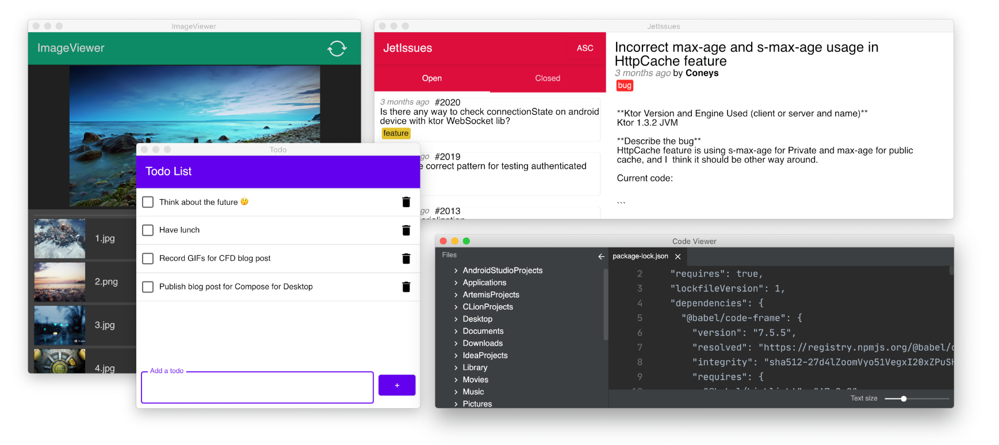
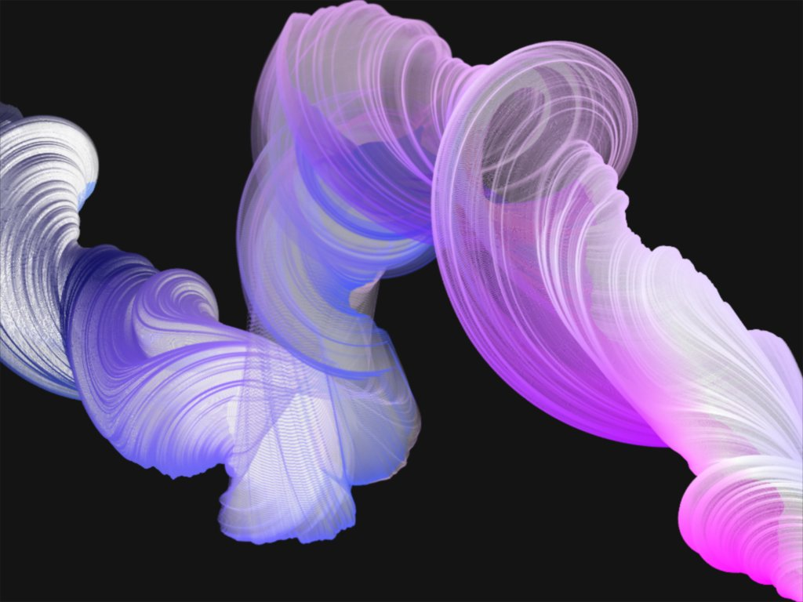
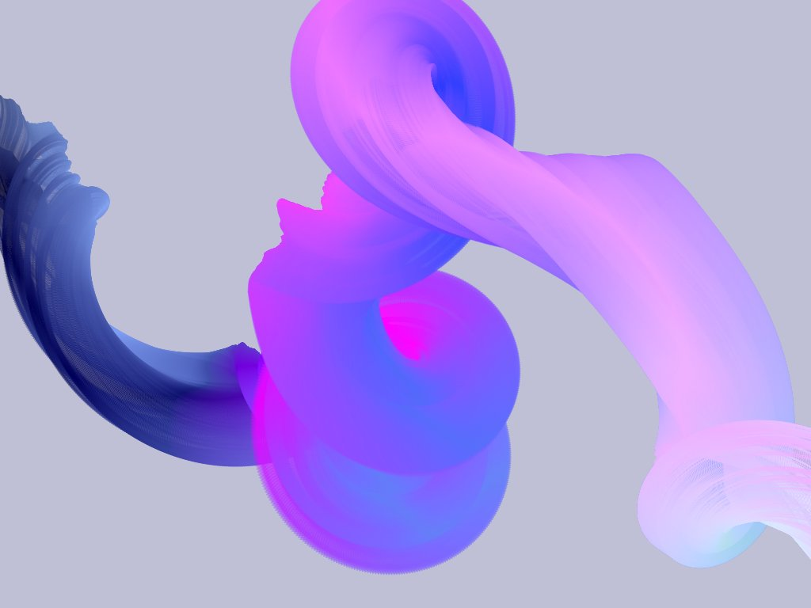
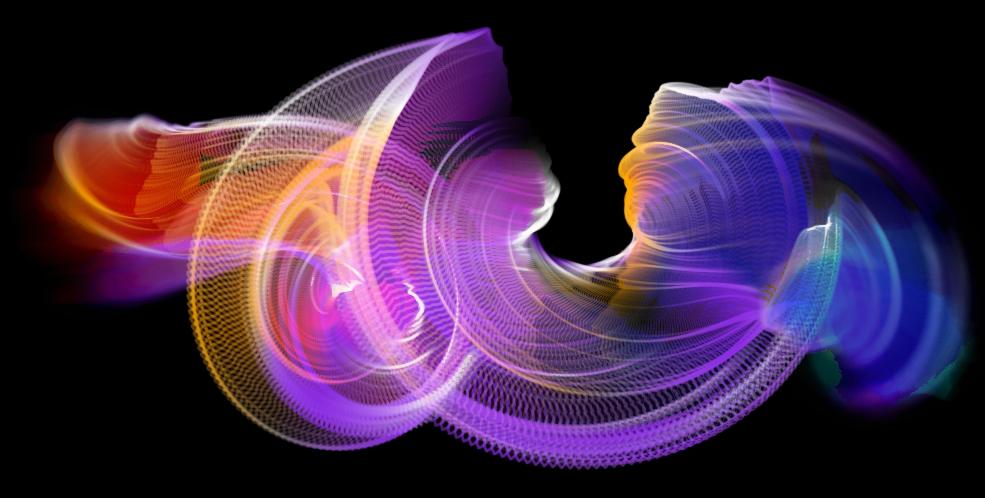
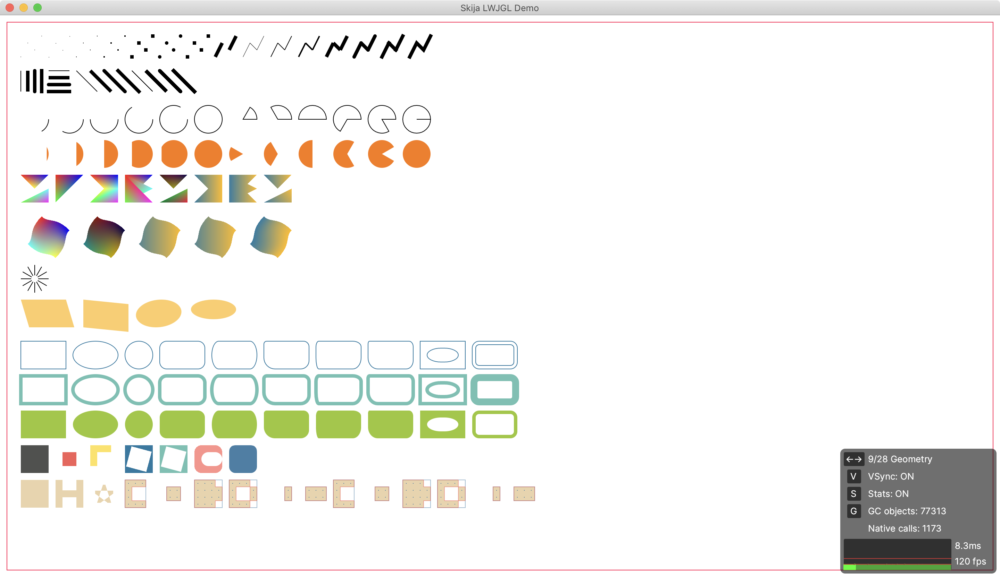
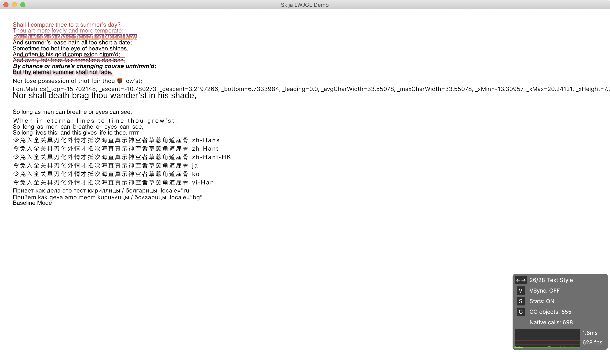
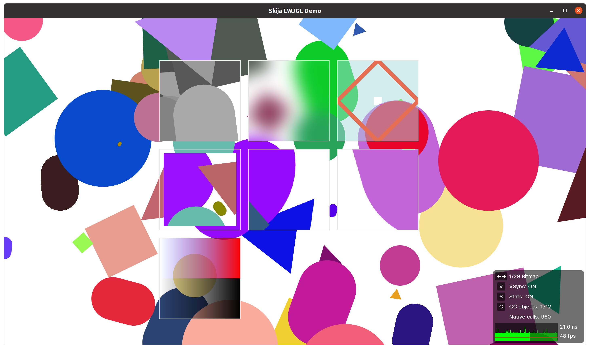
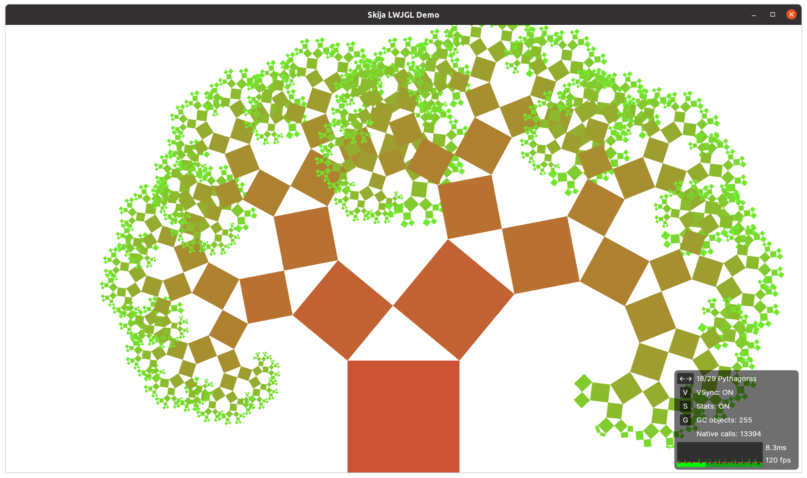
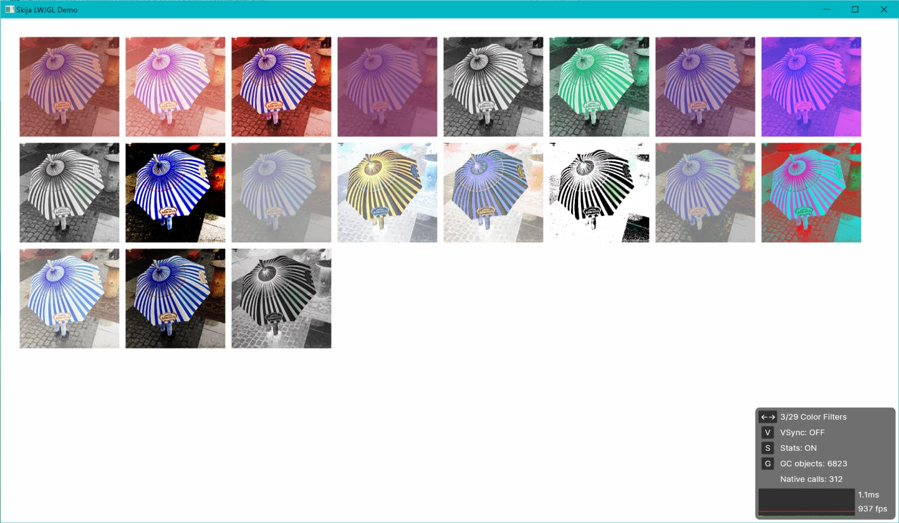
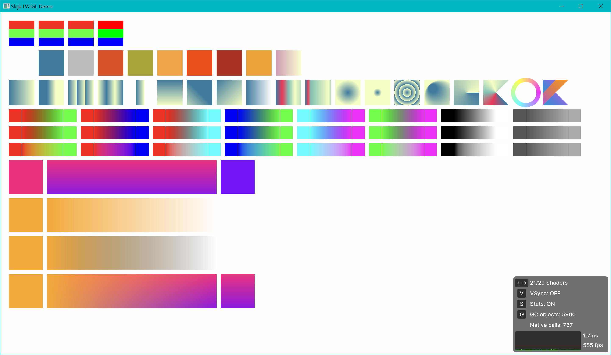

# Skija: Skia bindings for Java

Skia is an open source 2D graphics library which provides common APIs that work across a variety of hardware and software platforms. Skija is a high-quality Java bindings for Skia.


## Motivation: Why Skia?

A modern graphic toolkit allows you to build all sorts of graphical UIs without being constrained by existing frameworks:

- custom UI widget libraries and whole toolkits,
- graphs, diagrams,
- visualizations,
- games.

Java has several offerings here: Graphics2D from AWT, GraphicsContext from JavaFX. Skia outperforms all of them in almost every benchmark, while also offering many additional features:

- extensive color spaces support,
- modern typography with open type features, variable typefaces, correct multi-script text handling, emojis,
- highly-optimized GPU rendering,
- modern GPU backends, including Vulkan and Metal,
- built-in caching and compositing facilities.

Skia has a proven track record of industrial-scale project relying on it for all things graphics:

- Google Chrome,
- Android,
- Flutter,
- Firefox Canvas,
- Xamarin.

## Built with Skija

[Compose for Desktop](https://www.jetbrains.com/lp/compose/), declarative UI toolkit for Kotlin:



[Robert Felker](https://twitter.com/BlueAquilae/status/1322696020329902082) demos:

|||
|---|---|
|||

[Skija demo app](examples/lwjgl):

|||
|---|---|
|||
|||

## Why hand-crafted bindings

Automatically generated bindings for Skia exist, but don’t seem to have high adoption:

- [github.com/bytedeco/javacpp-presets/tree/master/skia](https://github.com/bytedeco/javacpp-presets/tree/master/skia)
- [github.com/eungju/skia-javacpp](https://github.com/eungju/skia-javacpp)

Skija project has a goal of providing great Java-native API that are natural to use. In particular:

- full automatic memory management, no pointer abstractions leaking,
- natural use of Java classes, interfaces, inheritance, singletons,
- consistent naming following Java conventions, including getters/setters for properties,
- typed enums instead of integer constants,
- native Java platform abstractions instead of wrapped Skia/C++ ones (strings, arrays, streams, files, byte buffers, AutoCloseable),
- hiding implementation details, e.g. transparent string encoding conversion, byte/code point indices conversion,
- fluent builder-style APIs where possible,
- lightweight data classes where possible (Point, Rect, FontMetrics, etc are not mirrored by native instances).

The ultimate goal for Skija is to feel as Java library and not having to think about native part at all.

## Current status

Active development. Pre-alpha. Everything will change without notice.

Core progress:

```
Bitmap               ▓▓▓▓▓▓▓▓▓▓
Canvas               ▓▓▓▓▓▓▓▓░░
Color                ▓░░░░░░░░░
ColorFilter          ▓▓▓▓▓▓▓▓▓▓
ColorInfo            ▓▓▓▓▓▓▓▓▓▓
ColorSpace           ▓▓▓▓░░░░░░
Data                 ▓▓▓▓▓▓▓▓▓░
Drawable             ▓▓▓▓▓▓▓▓░░
Flattenable          ░░░░░░░░░░
Font                 ▓▓▓▓▓▓▓▓▓▓
FontData             ░░░░░░░░░░
FontManager          ▓▓▓▓▓▓▓▓▓░ 
FontStyle            ▓▓▓▓▓▓▓▓▓▓
FontStyleSet         ▓▓▓▓▓▓▓▓▓▓
Image                ▓▓░░░░░░░░
ImageFilters         ▓▓▓▓▓▓▓▓▓▓
ImageInfo            ▓▓▓▓▓▓▓▓▓▓
MaskFilter           ▓▓▓▓▓▓▓▓▓▓
Matrix33             ▓▓▓░░░░░░░
Matrix44             ▓▓▓░░░░░░░
Paint                ▓▓▓▓▓▓▓▓░░
Path                 ▓▓▓▓▓▓▓▓▓▓
PathEffects          ▓▓▓▓▓▓▓▓▓▓
PathMeasure          ▓▓▓▓▓▓▓▓▓▓
PaintFilterCanvas    ▓▓▓▓▓▓▓▓▓▓
Picture              ▓▓▓▓▓▓▓▓▓░
PictureRecorder      ▓▓▓▓▓▓▓▓▓▓
PixelRef             ▓▓▓▓▓▓▓▓▓▓
Pixmap               ░░░░░░░░░░
Region               ▓▓▓▓▓▓▓▓▓▓
ScalerContext        ░░░░░░░░░░
Shader               ▓▓▓▓▓▓▓▓▓▓
ShadowUtils          ▓▓▓▓▓▓▓▓▓▓
Stream               ░░░░░░░░░░
String               ▓░░░░░░░░░
Surface              ▓░░░░░░░░░
TextBlob             ▓▓▓▓▓▓▓▓▓▓
TextBlobBuilder      ▓▓▓▓▓▓▓▓▓▓
Typeface             ▓▓▓▓▓▓▓▓░░
```

Shaper progress:

```
BiDiRunIterator      ▓▓▓▓▓▓▓▓▓▓
FontMgrRunIterator   ▓▓▓▓▓▓▓▓▓▓
FontRunIterator      ▓▓▓▓▓▓▓▓▓▓
HbIcuScriptRunIter   ▓▓▓▓▓▓▓▓▓▓
IcuBidiRunIterator   ▓▓▓▓▓▓▓▓▓▓
LanguageRunIterator  ▓▓▓▓▓▓▓▓▓▓
RunHandler           ▓▓▓▓▓▓▓▓▓▓
RunInfo              ▓▓▓▓▓▓▓▓▓▓
ScriptRunIterator    ▓▓▓▓▓▓▓▓▓▓
Shaper               ▓▓▓▓▓▓▓▓▓▓
TextBlobBldRunHndlr  ▓▓▓▓▓▓▓▓▓▓
```

Paragraph progress:

```
FontCollection       ▓▓▓▓▓▓▓▓▓▓
LineMetrics          ▓▓▓▓▓▓▓▓▓░
Paragraph            ▓▓▓▓▓▓▓▓▓▓
ParagraphCache       ▓▓▓▓▓▓▓▓▓▓
ParagraphStyle       ▓▓▓▓▓▓▓▓▓▓
ParagraphBuilder     ▓▓▓▓▓▓▓▓▓▓
TextStyle            ▓▓▓▓▓▓▓▓▓▓
TypefaceFontProvider ▓▓▓▓▓▓▓▓▓▓
```

## Using Skija

Maven:

```xml
<repositories>
  <repository>
    <id>space-maven</id>
    <url>https://packages.jetbrains.team/maven/p/skija/maven</url>
  </repository>
</repositories>

<dependencies>
  <dependency>
    <groupId>org.jetbrains.skija</groupId>
    <artifactId>skija-${platform}</artifactId>
    <version>${version}</version>
  </dependency>
</dependencies>
```

Gradle:

```gradle
repositories {
  maven {
    url "https://packages.jetbrains.team/maven/p/skija/maven"
  }
}

dependencies {
  api "org.jetbrains.skija:skija-${platform}:${version}"
}
```

Replace `${platform}` and `${version}` with:

Platform | `${platform}` | `${version}`
---------|---------------|-------------
macOS    | `macos`       | 
Linux    | `linux`       | 
Windows  | `windows`     | 

## Developing Skija

### Checkout

```sh
git clone https://github.com/JetBrains/skija.git
cd skija
```

### Using prebuilt Skia

Download prebuilt Skia from [this repository](https://github.com/JetBrains/skia-build/releases).

Unpack and set

```
export SKIA_DIR=~/Downloads/Skia-m87-4893488-macos-Release-x64
```

To build Skia from scratch, consult [JetBrains/skia-build](https://github.com/JetBrains/skia-build).

### Building Skija

Prerequisites:

- CMake
- Ninja
- JDK 11+ and JAVA_HOME
- Maven

```sh
./script/install.sh
```

This will install local versions of these Skija artifacts:

```
org.jetbrains.skija:skija-shared:0.0.0-SNAPSHOT
org.jetbrains.skija:skija-native:0.0.0-SNAPSHOT
```

### Running examples

Examples require latest master build of Skija installed locally in `.m2` (see [Building](#building-skija)).

```sh
./script/install.sh
```

GLFW (via LWJGL), Java and Maven:

```sh
cd examples/lwjgl
./script/exec.sh
```

JOGL, Kotlin and Gradle:

```sh
cd examples/jogl
./gradlew run
```
